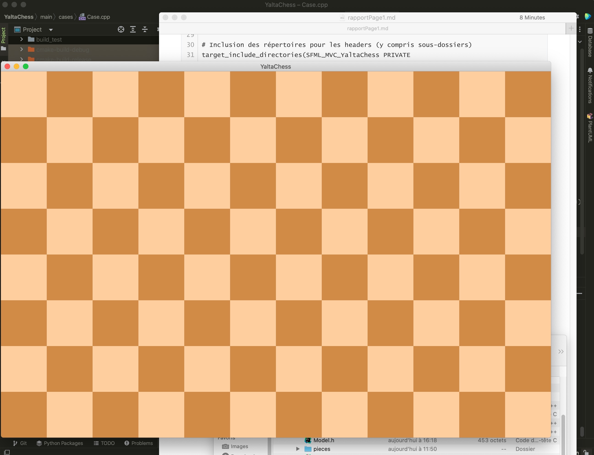
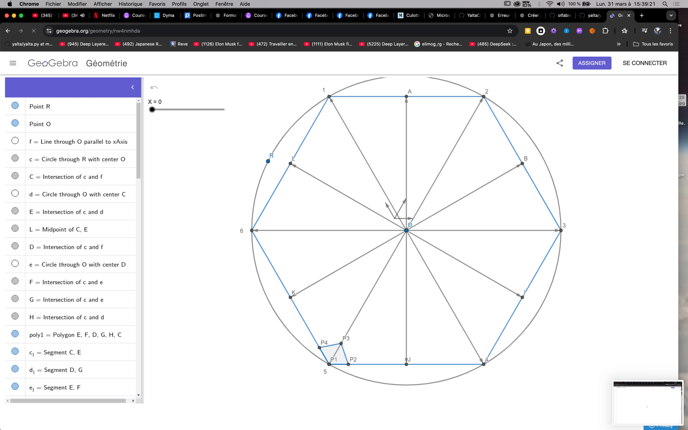
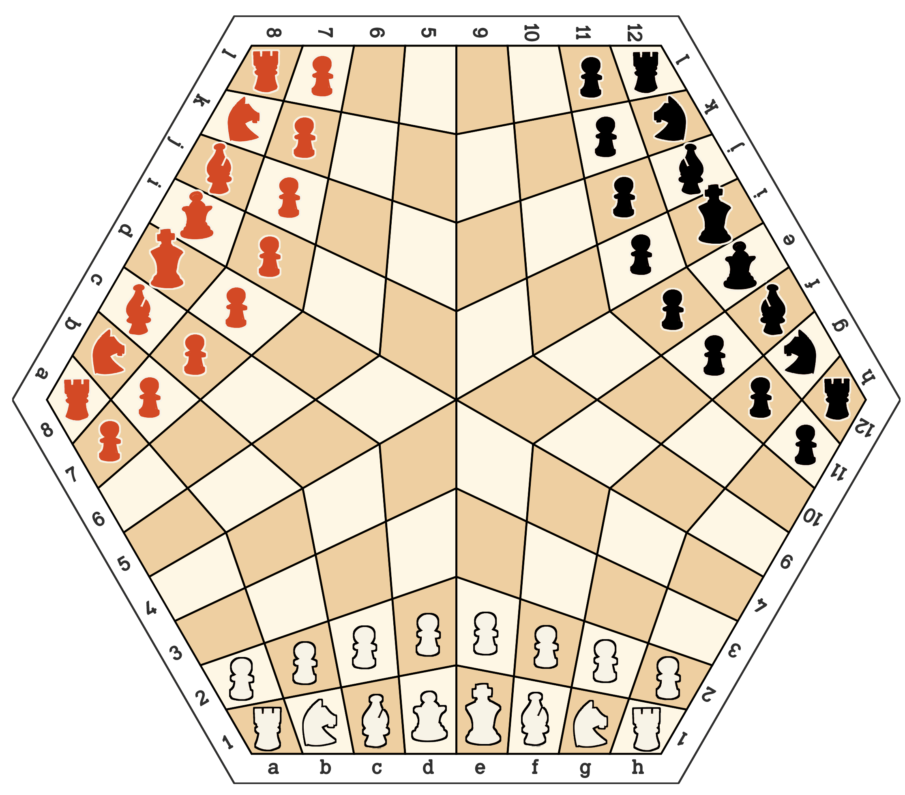
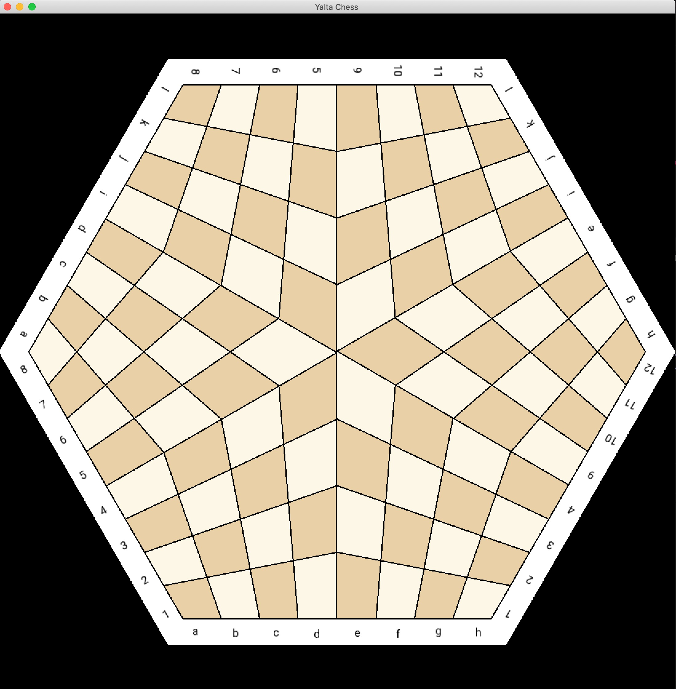
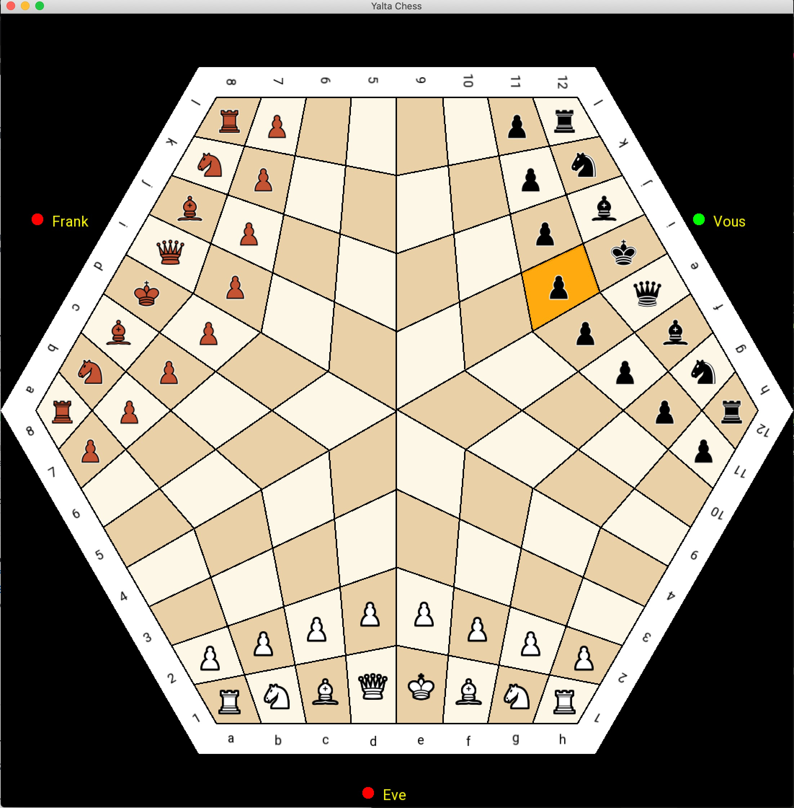

# YaltaChess

Ceci est le rapport qui explique toutes mes démarches, mes recherches pour le codage du jeu en C++.

J'y intégre tous les résultats de mes recherches au fur-et-à-mesure de mes recherches et de l'avancement de mon projet.

## Sources

 CMake SFML Project Template https://github.com/SFML/cmake-sfml-project


## Choix initiaux et contraintes

Le codage se fera en C++ en architecture Model Vue Controler. Le jeu aura une interface graphique. Pour intégrer le graphisme, je vais utiliser SFML 3.0.0 qui est une version que je dois compiler et compatible avec mon système d'exploitation. en effet , je code sur mon MacOS Catalina qui est un vieux modèle, je dois systématiquement vérifier la comptabilité des librairies.


## Étape 1: compréhension, réflexion, recherche

Pour les deux premières séances de TP, j'ai préféré me concentrer sur la recherche d'informations, bien comprendre les technologies que je devrai utiliser et comment les utiliser dans une architecture MVC.

Pour l'instant je ne me concentre pas sur les aspects spéficiques du code: design patterns, algorithmes avancées mais davantage dans la mise en route du projet, l'architecture MVC et les relations entre les entités.

Mon principal but est débuter correctement le projet avec une bases solides et une organisation adaptée pour coder proprement en MVC.


## Étape 2: installation de SFML 

```bash
brew install sfml
```

L'installation a été très longue (1 heure) 

Je vérifie l'installation s'est bien passée

```bash
pkg-config --modversion sfml-system
3.0.0
```

L'installation de SFML 3 s'est bien passée.


## Étape 3: tester SFML


J'ai crée un fichier `CMakePresets.json`

Ce fichier sert à **simplifier la configuration de ton projet avec CMake** en définissant des paramètres prédéfinis. Il permet de centraliser les options importantes pour que tu n'aies pas à les taper manuellement à chaque fois.

```json
{
  "version": 3,
  "configurePresets": [
    {
      "name": "default",
      "description": "default settings",
      "generator": "Unix Makefiles",
      "binaryDir": "${workspaceFolder}/build",
      "cacheVariables": {
        "CMAKE_BUILD_TYPE": "Debug"
      }
    }
  ]
}
```

### À quoi ça sert ?

- 📂 **`binaryDir`** : C'est l'endroit où ton projet va être compilé (au lieu de mélanger les fichiers générés avec ton code source).
- 🐞 **`CMAKE_BUILD_TYPE`** : Ici, le mode `Debug` est activé, ce qui inclut des informations utiles pour déboguer ton code (comme les symboles de débogage).
  

j'ai crée un dossier `main` où je vais placer le code principal

Dans ce dossier, j'ai crée un fichier `CMakeLists.txt`

Ce fichier est **le cœur de ton projet** sous CMake. Il décrit comment ton projet doit être configuré, compilé et lié.

```cmake
cmake_minimum_required(VERSION 3.25.2)
project(CMakeSFMLProject LANGUAGES CXX)

set(CMAKE_RUNTIME_OUTPUT_DIRECTORY ${CMAKE_BINARY_DIR}/bin)

include(FetchContent)
FetchContent_Declare(SFML
        GIT_REPOSITORY https://github.com/SFML/SFML.git
        GIT_TAG 3.0.0)
FetchContent_MakeAvailable(SFML)

add_executable(main main.cpp)
target_link_libraries(main PRIVATE sfml-graphics)
target_compile_features(main PRIVATE cxx_std_17)
```

```cmake
cmake_minimum_required(VERSION 3.25.2)
project(CMakeSFMLProject LANGUAGES CXX) 
```

- Spécifie la version minimale de CMake requise.
- Définit le nom de ton projet (`CMakeSFMLProject`) et précise que c'est un projet en **C++**.

```cmake
set(CMAKE_RUNTIME_OUTPUT_DIRECTORY ${CMAKE_BINARY_DIR}/bin)
```

- Change l'emplacement des exécutables générés.
- Ici, les exécutables seront placés dans le dossier `/build/bin`.

```cmake
include(FetchContent)
FetchContent_Declare(SFML
    GIT_REPOSITORY https://github.com/SFML/SFML.git
    GIT_TAG 3.0.0)
FetchContent_MakeAvailable(SFML)
```

- **`FetchContent`** est une méthode puissante qui télécharge et configure automatiquement des bibliothèques externes.
- Ici, il télécharge et configure la bibliothèque **SFML** (version 3.0.0) directement depuis GitHub.

```cmake
add_executable(main main.cpp)
target_link_libraries(main PRIVATE sfml-graphics)
target_compile_features(main PRIVATE cxx_std_17)
```

- **`add_executable`** crée ton exécutable principal (`main`) en utilisant ton fichier `main.cpp`.
-  **`target_link_libraries`** indique que ton exécutable doit être lié avec **SFML** (le module graphique).
-  **`target_compile_features`** précise que ton code utilise les fonctionnalités du standard **C++17**.


J'ai crée un fichier `main.cpp` ou le contneu sera provisoir 

```cpp
#include <SFML/Graphics.hpp>

int main()
{
    auto window = sf::RenderWindow(sf::VideoMode({1920u, 1080u}), "YaltaChess");
    window.setFramerateLimit(144);

    while (window.isOpen())
    {
        while (const std::optional event = window.pollEvent())
        {
            if (event->is<sf::Event::Closed>())
            {
                window.close();
            }
        }

        window.clear();
        window.display();
    }
}
```


### Commandes pour compiler mon code principal

```bash
cmake -B build // par defaut mais dans mon cas, c'est la ligne du bas
cmake -B build_main -S main
```

La commande initiale (`cmake -B build`) **génère les fichiers de configuration** (Makefiles, cache, etc.) et télécharge les dépendances (comme SFML via `FetchContent`). C'est normal que ce soit plus long la première fois.


```bash
cmake --build build // par defaut mais dans mon cas, c'est la ligne du bas
cmake --build build_main
```

La commande suivante (`cmake --build build`) **compile tout le projet**, y compris les dépendances. C'est aussi plus long au premier passage. Cette commande **ne recompilera que les fichiers modifiés**, rendant la compilation beaucoup plus rapide.(builds "incrémentiels" )


j'ai crée un dossier `tests` où je vais placer le code pour tester 

J'ai créer un fichier `testSFML3.cpp`

```cpp
#include <SFML/Graphics.hpp>

int main()
{
    auto window = sf::RenderWindow(sf::VideoMode({1920u, 1080u}), "CMake Test SFML");
    window.setFramerateLimit(144);

    while (window.isOpen())
    {
        while (const std::optional event = window.pollEvent())
        {
            if (event->is<sf::Event::Closed>())
            {
                window.close();
            }
        }

        window.clear();
        window.display();
    }
}
```

j'ai créé un fichier `CMakeLists.txt`

```cmake
cmake_minimum_required(VERSION 3.25.2)
project(TestSFML LANGUAGES CXX)

include(FetchContent)
FetchContent_Declare(SFML
        GIT_REPOSITORY https://github.com/SFML/SFML.git
        GIT_TAG 3.0.0)
FetchContent_MakeAvailable(SFML)

add_executable(testSFML3 testSFML3.cpp)
target_link_libraries(testSFML3 PRIVATE sfml-graphics)
target_compile_features(testSFML3 PRIVATE cxx_std_17)
```


### Commandes pour lancer le code de test SFML


```bash
cmake -B build_test -S tests   
```

Génèration des fichiers de configuration

```bash
cmake --build build_test
```

Compilation de tout le projet

```bash
./build_test/testSFML3
```

Lancement du test


### Étape 4: mise en place de la structure MVC


Voici ma structure optimisée avec SFML 3 pour bien démarrer mon projet. 

Cette base inclut les bonnes pratiques et une architecture claire:

- **Séparation claire** : Chaque composant respecte bien le pattern MVC.
- **Lisibilité** : Les classes sont courtes et claires.
- **Extensibilité** : Cette structure permet d'ajouter facilement des entités, des scènes ou d'autres fonctionnalités.
-  **Optimisation SFML 3** : Utilisation de `std::optional` pour améliorer la gestion d'événements.

L'architecture **MVC** (Modèle-Vue-Contrôleur) est une structure de code puissante qui permet de séparer la logique métier, l'affichage et la gestion des interactions utilisateur. 


L'architecture MVC se divise en trois parties principales :

- **Modèle (Model)** → Gestion des données et logique métier.
- **Vue (View)** → Gestion de l'affichage graphique avec SFML.
- **Contrôleur (Controller)** → Gestion des événements et interactions utilisateur.


```bash
/YaltaChess
│ 
│── /main
│   ├── CMakeLists.txt
│   ├── Model.h
│   ├── Model.cpp
│   ├── View.h
│   ├── View.cpp
│   ├── Controller.h
│   ├── Controller.cpp
│   └── main.cpp
│── /build_main   <-- (sera créé lors de la compilation)
```


1 fichier `/main/Model.h`

Gère les données, les règles du jeu, et la logique métier.

```cpp
#ifndef MODEL_H
#define MODEL_H

#include <SFML/Graphics.hpp>

class Model {
public:
    Model();  
    void update();  // Mise à jour des données du modèle (ex : position des pièces d'échecs).
};

#endif // MODEL_H
```


1 fichier `/main/Model.cpp`

Gère les données, les règles du jeu, et la logique métier.

```cpp
#include "Model.h"

Model::Model() {
    // Initialisation des données (ex : position initiale des pièces)
}

void Model::update() {
    // Exemple : Mettre à jour les positions des pièces, gérer les règles du jeu, etc.
}
```

**Rôle du `Model` :**

- Stocke les informations clés (ex : position des pièces d'échecs).
- Met à jour les données en fonction des règles métier (ex : déplacement légal des pièces).


1 fichier `/main/View.h`

Gère l'affichage et le rendu graphique à l'écran.

```cpp
#ifndef VIEW_H
#define VIEW_H

#include <SFML/Graphics.hpp>

class View {
public:
    View(sf::RenderWindow& window);
    void render(); // Dessine les éléments graphiques
private:
    sf::RenderWindow& m_window; // Référence vers la fenêtre SFML
};

#endif // VIEW_H
```


1 fichier `/main/View.cpp`

Gère l'affichage et le rendu graphique à l'écran.

```cpp
#include "View.h"

View::View(sf::RenderWindow& window) : m_window(window) {}

void View::render() {
    m_window.clear(sf::Color::Black);  // Couleur de fond par défaut
    // Dessine les éléments graphiques ici: les pièces, l'échiquier, etc
    m_window.display();
}
```


**Rôle du `View` :**

- Affiche les éléments graphiques.
- Récupère les informations du `Model` pour afficher correctement les données à l'utilisateur.
- Ne contient **aucune** logique métier.


1 fichier `/main/Controller.h`

Gère les entrées utilisateur (clics, clavier) et met à jour le modèle et la vue.

```cpp
#ifndef CONTROLLER_H
#define CONTROLLER_H

#include <SFML/Graphics.hpp>
#include "Model.h"
#include "View.h"

class Controller {
public:
    Controller(Model& model, View& view);
    void processEvents(sf::RenderWindow& window); // Gère les événements SFML
private:
    Model& m_model;
    View& m_view;
};

#endif // CONTROLLER_H
```


1 fichier `/main/Controller.cpp`

Gère les entrées utilisateur (clics, clavier) et met à jour le modèle et la vue.

```cpp
#include "Controller.h"

Controller::Controller(Model& model, View& view) : m_model(model), m_view(view) {}

void Controller::processEvents(sf::RenderWindow& window) {
    while (const std::optional event = window.pollEvent()) {
        if (event->is<sf::Event::Closed>()) {
            window.close();
        }
      // Ici, gestion des clics sur les pièces d'échecs, les déplacements, etc.
    }
}
```

**Rôle du `Controller` :**

- Récupère les événements utilisateurs (clics, mouvements de souris, etc.).
- Met à jour le `Model` en fonction de ces interactions.
- Informe la `View` des changements pour que l'affichage soit correct.


1 fichier `/main/main.cpp`

Point d'entrée principal du programme qui connecte le modèle, la vue et le contrôleur.

```cpp
#include <SFML/Graphics.hpp>
#include "Model.h"
#include "View.h"
#include "Controller.h"

int main() {
    auto window = sf::RenderWindow(sf::VideoMode({1920u, 1080u}), "SFML MVC Example");
    window.setFramerateLimit(144);

    Model model; // Création du modèle
    View view(window); // Création de la vue (lié à la fenêtre)
    Controller controller(model, view); // Création du contrôleur

    while (window.isOpen()) {
        controller.processEvents(window);  // Gestion des événements (entrées utilisateurs)
        model.update();                    // Mise à jour des données
        view.render();                     // Rendu graphique et mise à jour affichage
    }

    return 0;
}
```


**Rôle du `main` :**

- Initialise les trois composants (`Model`, `View`, `Controller`).
- Utilise une boucle infinie pour :
  - Traiter les événements avec le **Controller**.
  - Mettre à jour les données avec le **Model**.
  - Afficher les résultats avec la **View**.


**Cycle de fonctionnement du code (Flux MVC)**

Voici le cycle complet de fonctionnement :

1. **Démarrage du programme**
    → Le `main` crée une fenêtre SFML et initialise les trois composants.
2. **Événements utilisateur (input)**
    → Le `Controller` intercepte les interactions (ex : clic sur une pièce).
    → Il met à jour le `Model` en conséquence (ex : déplacement d'une pièce).
3. **Mise à jour des données**
    → Le `Model` applique les règles du jeu (ex : vérifie si le déplacement est légal).
4. **Affichage (output)**
    → La `View` récupère les informations du `Model` et met à jour l’écran.
5. **Répétition**
    → Ce cycle se répète tant que la fenêtre est ouverte.


Je dois aussi modifier le fichier ` /main/CMakeLists.txt`

```cmake
cmake_minimum_required(VERSION 3.25.2)
project(SFML_MVC_YaltaChess LANGUAGES CXX)

set(CMAKE_RUNTIME_OUTPUT_DIRECTORY ${CMAKE_BINARY_DIR}/bin)

include(FetchContent)
FetchContent_Declare(
        SFML
        GIT_REPOSITORY https://github.com/SFML/SFML.git
        GIT_TAG 3.0.0
)
FetchContent_MakeAvailable(SFML)

# Inclusion de tous les fichiers du dossier actuel (car CMakeLists.txt est dans /main)
file(GLOB_RECURSE SRC_FILES ./*.cpp)

# Création de l'exécutable avec tous les fichiers sources
add_executable(SFML_MVC_YaltaChess ${SRC_FILES})

# Ajout des bibliothèques SFML
target_link_libraries(SFML_MVC_YaltaChess PRIVATE sfml-graphics sfml-window sfml-system)

# Standard C++17
target_compile_features(SFML_MVC_YaltaChess PRIVATE cxx_std_17)

# Inclusion des répertoires pour les headers
target_include_directories(SFML_MVC_YaltaChess PRIVATE ${CMAKE_SOURCE_DIR}/main)

```

#### **1. Définition de la version de CMake**

```cmake
cmake_minimum_required(VERSION 3.25.2)
```

- Cette ligne indique la version minimale de CMake requise.
   → **`VERSION 3.25.2`** est nécessaire car SFML 3 utilise des fonctionnalités modernes de CMake.


#### **2. Nom du projet**

```cmake
project(SFML_MVC_YaltaChess LANGUAGES CXX)
```

- Définit le nom du projet (`SFML_MVC_YaltaChess`).
- **`LANGUAGES CXX`** indique que ton projet est en C++.


#### **3. Définir le répertoire de sortie des exécutables**

```cmake
set(CMAKE_RUNTIME_OUTPUT_DIRECTORY ${CMAKE_BINARY_DIR}/bin)
```

- Cette ligne précise que l'exécutable sera généré dans le dossier `/bin` à l'intérieur du répertoire de build (`build_main`).
   → Cela permet de garder une structure propre avec un exécutable bien séparé des fichiers de compilation.


#### **4. Gestion de la bibliothèque SFML via `FetchContent`**

```cmake
include(FetchContent)
FetchContent_Declare(
        SFML
        GIT_REPOSITORY https://github.com/SFML/SFML.git
        GIT_TAG 3.0.0
)
FetchContent_MakeAvailable(SFML)
```

- **`include(FetchContent)`** : Active le module `FetchContent` qui permet de télécharger et de configurer des bibliothèques directement depuis GitHub.
- **`FetchContent_Declare()`** : Indique à CMake d'aller chercher SFML 3 sur le dépôt GitHub officiel.
-  **`GIT_TAG 3.0.0`** : Utilise la version 3.0.0 de SFML (la plus récente).
- **`FetchContent_MakeAvailable(SFML)`** : Télécharge et configure automatiquement SFML dans ton projet.


#### **5. Inclusion des fichiers sources**

```cmake
file(GLOB_RECURSE SRC_FILES ./*.cpp)
```

- Cette commande recherche **récursivement** tous les fichiers `.cpp` dans le répertoire `/main` (car ton `CMakeLists.txt` est dans `/main`).
   → Cela permet d'ajouter automatiquement tous tes fichiers sources sans les lister manuellement.
   → **Exemple :** Si tu ajoutes `Piece.cpp`, il sera automatiquement inclus.


#### **6. Création de l'exécutable**

```cmake
add_executable(SFML_MVC_YaltaChess ${SRC_FILES})
```

- Cette ligne crée l'exécutable nommé **`SFML_MVC_YaltaChess`** en utilisant tous les fichiers contenus dans la variable `${SRC_FILES}`.
   → C'est l'étape clé qui génère ton programme final.


#### **7. Ajout des bibliothèques SFML**

```cmake
target_link_libraries(SFML_MVC_YaltaChess PRIVATE sfml-graphics sfml-window sfml-system)
```

- **`target_link_libraries`** : Relie ton projet aux bibliothèques nécessaires de SFML :

- **`sfml-graphics`** : Pour la gestion des graphismes (sprites, formes, etc.).
- **`sfml-window`** : Pour la gestion des fenêtres et des événements.
- **`sfml-system`** : Pour les outils de gestion du temps et les utilitaires.


#### **8. Activation du standard C++17**

```cmake
target_compile_features(SFML_MVC_YaltaChess PRIVATE cxx_std_17)
```

-  Active la norme **C++17** pour ton projet.
   → SFML 3 est conçu pour fonctionner avec cette version ou supérieure.


#### **9. Inclusion des répertoires de headers**

```cmake
target_include_directories(SFML_MVC_YaltaChess PRIVATE ${CMAKE_SOURCE_DIR}/main)
```

- Indique à CMake d'inclure le dossier `/main` pour retrouver les fichiers `.h` (headers).
   → Cela permet que les `#include "Model.h"` ou `#include "Controller.h"` fonctionnent sans chemin compliqué.


#### **10. Commandes finales pour compiler et exécuter**

Dans ton terminal, à la racine de ton projet :

##### ➤ **Générer les fichiers de build**

```bash
cmake -B build_main -S main
```

- Généra le répertoire `build_main` avec les fichiers de compilation.


##### ➤ **Compiler le projet**

```bash
cmake --build build_main
```

-  Compile ton projet et génère l'exécutable dans `build_main/bin/SFML_MVC_YaltaChess`.


##### ➤ **Exécuter ton projet**

```bash
./build_main/bin/SFML_MVC_YaltaChess
```

-  Lance ton application SFML.


### Étape 5: création de la hierarchie orientée objet des pièces 

Chaque pièce d’échecs Yalta sera un objet dérivant d'une classe abstraite commune (`Piece`), selon ce schéma :

```scss
Piece (abstraite)
 │
 ├── Roi
 ├── Dame
 ├── Tour
 ├── Fou
 ├── Cavalier
 └── Pion
```


**Organisation des fichiers**

````bash
/main
│── Model.h
│── Model.cpp
│── View.h
│── View.cpp
│── Controller.h
│── Controller.cpp
│── main.cpp
│
└── /pieces
    ├── Piece.h
    ├── Piece.cpp
    ├── Roi.h
    ├── Roi.cpp
    ├── Dame.h
    ├── Dame.cpp
    ├── Tour.h
    ├── Tour.cpp
    ├── Fou.h
    ├── Fou.cpp
    ├── Cavalier.h
    ├── Cavalier.cpp
    ├── Pion.h
    └── Pion.cpp

````


Fichier `pieces/Piece.h`

```cpp
#ifndef PIECE_H
#define PIECE_H

#include <SFML/Graphics.hpp>

enum Couleur { BLANC, NOIR, ROUGE };

// Classe abstraite représentant une pièce du jeu Yalta
class Piece {
protected:
    sf::Vector2i position; // Position sur l'échiquier
    Couleur couleur;       // Couleur de la pièce (joueur)

public:
    Piece(sf::Vector2i pos, Couleur coul);
    virtual ~Piece() = default;

    // Vérifie la validité du déplacement spécifique à chaque pièce
    virtual bool mouvementValide(sf::Vector2i nouvellePos) const = 0;

    // Dessine graphiquement la pièce (SFML)
    virtual void dessiner(sf::RenderWindow& window) const = 0;

    // Accesseurs
    sf::Vector2i getPosition() const;
    void setPosition(sf::Vector2i nouvellePos);
    Couleur getCouleur() const;
};

#endif
```


Fichier `pieces/Piece.cpp`

```cpp
#include "Piece.h"

Piece::Piece(sf::Vector2i pos, Couleur coul)
        : position(pos), couleur(coul) {}

sf::Vector2i Piece::getPosition() const {
    return position;
}

void Piece::setPosition(sf::Vector2i nouvellePos) {
    position = nouvellePos;
}

Couleur Piece::getCouleur() const {
    return couleur;
}
```


Un exemple de pièce du jeu qui va heriter de `piece` : fichiers `Roi.h` et `Roi.cpp`


```cpp
#ifndef ROI_H
#define ROI_H

#include "Piece.h"

// Classe Roi héritant de Piece
class Roi : public Piece {
public:
    Roi(sf::Vector2i pos, Couleur coul);
    bool mouvementValide(sf::Vector2i nouvellePos) const override;
    void dessiner(sf::RenderWindow& window) const override;
};

#endif
```


```cpp
#include "Roi.h"
#include <cmath>

Roi::Roi(sf::Vector2i pos, Couleur coul) : Piece(pos, coul) {}

bool Roi::mouvementValide(sf::Vector2i nouvellePos) const {
    int dx = std::abs(nouvellePos.x - position.x);
    int dy = std::abs(nouvellePos.y - position.y);
    return (dx <= 1 && dy <= 1);
}

void Roi::dessiner(sf::RenderWindow& window) const {
    // Ici, dessiner le Roi (sprite ou forme)
}

```


### Étape 6: création de la hierarchie orientée objet des cases

La structure avec les cases intégrées

```bash
/main
│── Model.h
│── Model.cpp
│── View.h
│── View.cpp
│── Controller.h
│── Controller.cpp
│── main.cpp
│
├── /pieces
│   ├── Piece.h
│   ├── Piece.cpp
│   ├── Roi.h
│   ├── Roi.cpp
│   ├── Dame.h
│   ├── Dame.cpp
│   ├── Tour.h
│   ├── Tour.cpp
│   ├── Fou.h
│   ├── Fou.cpp
│   ├── Cavalier.h
│   ├── Cavalier.cpp
│   ├── Pion.h
│   └── Pion.cpp
│
└── /cases (nouveau dossier)
    ├── Case.h
    └── Case.cpp


```


Fichier `cases/Case.h`

```cpp
#ifndef CASE_H
#define CASE_H

#include <SFML/Graphics.hpp>
#include "../pieces/Piece.h"

class Case {
private:
    sf::Vector2i position;
    Piece* piece; // Pointeur vers une pièce ou nullptr si vide

public:
    Case(sf::Vector2i pos);

    bool estOccupee() const;
    Piece* getPiece() const;
    void setPiece(Piece* p);
    sf::Vector2i getPosition() const;

    void dessiner(sf::RenderWindow& window);
};

#endif

```


Fichier cases/Case.cpp

```cpp
#include "Case.h"

Case::Case(sf::Vector2i pos) : position(pos), piece(nullptr) {}

bool Case::estOccupee() const { return piece != nullptr; }

Piece* Case::getPiece() const { return piece; }

void Case::setPiece(Piece* p) { piece = p; }

sf::Vector2i Case::getPosition() const { return position; }

void Case::dessiner(sf::RenderWindow& window) {
    sf::RectangleShape carre({100.f, 100.f});
    carre.setPosition(position.x * 100.f, position.y * 100.f);
    carre.setFillColor((position.x + position.y) % 2 ? sf::Color(209,139,71) : sf::Color(255,206,158));
    window.draw(carre);
}

```


Quelques  modifications doivent être apportée:


Fichier `cases/Case.h`

```cpp
// Case.h (correction)
#ifndef CASE_H
#define CASE_H

#include <SFML/Graphics.hpp>
#include "../pieces/Piece.h"

class Case {
private:
    sf::Vector2i position;
    Piece* piece; // Pointeur vers une pièce ou nullptr

public:
    Case(sf::Vector2i pos);

    bool estOccupee() const;
    Piece* getPiece() const;
    void setPiece(Piece* p);
    sf::Vector2i getPosition() const;

    // Correction : ajout de const ici
    void dessiner(sf::RenderWindow& window) const;
};

#endif

```


Fichier `cases/Case.cpp`

```cpp
#include "Case.h"

Case::Case(sf::Vector2i pos) : position(pos), piece(nullptr) {}

bool Case::estOccupee() const { return piece != nullptr; }

Piece* Case::getPiece() const { return piece; }

void Case::setPiece(Piece* p) { piece = p; }

sf::Vector2i Case::getPosition() const { return position; }

// Correction ici :
void Case::dessiner(sf::RenderWindow& window) const {
    sf::RectangleShape carre({100.f, 100.f});
    carre.setPosition(sf::Vector2f(position.x * 100.f, position.y * 100.f));
    carre.setFillColor((position.x + position.y) % 2 ? sf::Color(209,139,71) : sf::Color(255,206,158));
    window.draw(carre);
}

```


Fichier `CMakeLists.txt` pour prendre en compte les pièces et cases

```txt
cmake_minimum_required(VERSION 3.25.2)
project(SFML_MVC_YaltaChess LANGUAGES CXX)

set(CMAKE_RUNTIME_OUTPUT_DIRECTORY ${CMAKE_BINARY_DIR}/bin)

include(FetchContent)
FetchContent_Declare(
        SFML
        GIT_REPOSITORY https://github.com/SFML/SFML.git
        GIT_TAG 3.0.0
)
FetchContent_MakeAvailable(SFML)

# Inclusion de tous les fichiers .cpp du dossier courant ET des sous-dossiers (pieces et cases)
file(GLOB_RECURSE SRC_FILES 
    ${CMAKE_CURRENT_SOURCE_DIR}/*.cpp
    ${CMAKE_CURRENT_SOURCE_DIR}/pieces/*.cpp
    ${CMAKE_CURRENT_SOURCE_DIR}/cases/*.cpp
)

# Création de l'exécutable avec tous les fichiers sources
add_executable(SFML_MVC_YaltaChess ${SRC_FILES})

# Ajout des bibliothèques SFML
target_link_libraries(SFML_MVC_YaltaChess PRIVATE sfml-graphics sfml-window sfml-system)

# Standard C++17
target_compile_features(SFML_MVC_YaltaChess PRIVATE cxx_std_17)

# Inclusion des répertoires pour les headers (y compris sous-dossiers)
target_include_directories(SFML_MVC_YaltaChess PRIVATE 
    ${CMAKE_CURRENT_SOURCE_DIR}
    ${CMAKE_CURRENT_SOURCE_DIR}/pieces
    ${CMAKE_CURRENT_SOURCE_DIR}/cases
)

```


on compile de nouveau

```bash
cmake -B build_main -S main
cmake --build build_main

./build_main/bin/SFML_MVC_YaltaChess 
```




Notre échiquier actuel utilise des cases carrées disposées dans un tableau 2D simple. C'est une première étape. Or, l'échiquier Yalta est hexagonal avec 96 cases trapézoïdales!

Pour gérer ce type spécifique d’échiquier, il faut adapter ta structure graphique et logique.

**Comment dessiner l'échiquier Yalta sous SFML clairement**

- Chaque case sera dessinée comme un **polygone SFML** (`sf::ConvexShape`).

```cpp
void Model::initialiserEchiquierYalta() {
    std::vector<std::vector<sf::Vector2f>> coordCases = {
            {{400,400},{450,380},{500,400},{450,420}},
            {{500,400},{550,380},{600,400},{550,420}},
            {{345.f,825.f},{395.f,805.f},{445.f,825.f},{395.f,845.f}},
     //etc...
    };
```

- Chaque case aura une coordonnée spécifique (personnalisée).
- On stockera dans notre classe `Case` chaque position sous forme de polygone (`sf::ConvexShape`) et on l’affichera ensuite directement.

**Problème rencontré pour la création de l'échiquier avec cette méthode**

En effet, cela signifie que je serais obligé de prendre toutes les coordonnées des 96 cases à partir du logiciel Photoshop sur une vraie photo d'un échiquier Yalta en fond.

Le travail reste tout de même **colossal**.

**Y'aurait-il une autre solution ?**

oui d'après mes recherches sur internet, j'ai trouvé une autre solution. Beaucoup moins chronophage et longue à réaliser:


1. La structure globale

   

- On part d'un **hexagone** (une forme à 6 côtés égaux).
- Cet hexagone central est divisé en **6 zones** distinctes appelées **"sextants"** (comme 6 parts égales d'un gâteau hexagonal).
- Chaque sextant contient des **petites cases** (cellules) dans lesquelles les pièces d'échecs peuvent se déplacer.

   

   

2. La forme de chaque case

- Contrairement aux cases habituelles (carrées), ici chaque case est un **quadrilatère** (4 côtés, mais pas forcément égaux).
- Pourquoi des quadrilatères ?
   Car c’est la forme géométrique qui permet de parfaitement remplir chaque sextant pour obtenir l’échiquier hexagonal global sans trous ni chevauchements.


3. Comment on dessine précisément chaque case ?

Voici simplement comment c’est fait dans ton programme :

Étape par étape :

**Étape 1 :** On choisit un **point central** de l’écran (`mid`) :

```cpp
mid = (largeur_ecran / 2, hauteur_ecran / 2)
```

**Étape 2 :** Autour de ce point central, on calcule **6 points extérieurs** pour créer l'hexagone global :

```cpp
points_hexagone = [
  haut-gauche, haut-droite, droite,
  bas-droite, bas-gauche, gauche
]
```

**Étape 3 :** Pour chaque sextant (zone), on prend deux points consécutifs de l'hexagone pour dessiner les cases à l’intérieur en effectuant des calculs géométriques précis (on appelle ça **interpolation linéaire**).

**Étape 4 :** On utilise ces points pour calculer les coins de chaque petite case (quadrilatère). Cela donne à chaque petite case sa position précise sur l'écran.


4. Alternance de couleurs des cases

Chaque case est alternativement colorée en blanc ou en noir selon une règle mathématique simple :

- Si la somme des coordonnées de la case (en x, y, et la zone) est paire, la case est blanche ; sinon, elle est noire :

```cpp
couleur = ((x + y + zone) % 2 == 0) ? blanc : noir;
```

Cela crée l’effet échiquier caractéristique.


5. Centrage final sur l’écran

Pour que l’échiquier soit parfaitement centré dans ta fenêtre graphique :

On décale toutes les cases d'une même distance (ici 50 pixels) vers la droite et vers le bas, afin que l'échiquier apparaisse exactement au milieu de l'écran :

```cpp
centre_final = (largeur_echiquier / 2 + décalage_x, hauteur_echiquier / 2 + décalage_y)
```


En résumé, dessiner l’échiquier Yalta, c'est :

- Créer un hexagone, puis le découper en 6 zones égales.
- Remplir chaque zone par des cases à 4 côtés, calculées mathématiquement.
- Alterner blanc/noir les cases.
- Décaler légèrement le tout pour le centrer sur l'écran.


Rappel pour compiler

```bash
cmake -B build_main -S main
cmake --build build_main

./build_main/bin/SFML_MVC_YaltaChess 
```


### Étape 7: création d'une fenêtre intro

Je me suis servi d'une I.A. générative pour créer l'image png qui porte le nom de mon application.

On a crée une classe Intro pour typer un objet de type Intro. On a donc créer un objet Intro qui s'occupe

d'afficher l'image d'introduction

```cpp
Intro intro(window);
if (!intro.initialize()) { // Charge l'image intro.png
    return -1; // Si l'image n'est pas trouvée, le programme s'arrête.
}
```

On a ajouté une boucle de façon que tant que l'intro n'est pas finie (elle dure 5 secondes), la fenetre reste ouverte et montre l'image.

Dans le fichier `intro.cpp`on s'occupe de charger l'image (initialisation) et redimensionne l'image pour qu'elle s'adapte à la fenêter du jeu (1100 x 1100)

Nous avons aussi intégré la polcie d'ecriture  **Press Start 2P** récupérée chez google font https://fonts.google.com/share?selection.family=Press+Start+2P pour faire un titre au dessus de l'image

Nosu avons aussi intégré une musique style des jeux des années 80 (libre de droits) que nous avons téléchargée sur le site https://pixabay.com/fr/music/search/genre/jeux%20vid%c3%a9o/?pagi=3


### Étape 8: création des labels

Nous devons créer les labels comportant lettres et chiffres. La numérotation est assez particulière sur un jeu d'échec Yalta. De plus les labels doivent être orientés selon le côté: perpendiculaire à l'arête du côté.



Donc le but est de placer les chiffres et lettres de la même manière que sur la photo ci-dessus avec un bandeau blanc autour du périmètre de l'échiquier. C'est dans `View.cpp` que tout est réalisé.

ici un extrait du code qui permet d'affecter à chaque côté, les labels

```cpp
void YaltaChessView::initBorderLabels()
{
    const float WIDTH    = 1000.f;
    const float OFFSET   = 50.f;
    const float OUTSET   = 25.f;      // distance label → bordure

    // Étiquettes par côté (dans l'ordre horaire)
    const std::vector<std::vector<std::string>> labels = {
            /* 0 (num.)   */ { "8","7","6","5","9","10","11","12" },
            /* 1 (lettres)*/ { "l","k","j","i","e","f","g","h"       },
            /* 2 (num.)   */ { "12","11","10","9","4","3","2","1"    },
            /* 3 (lettres)*/ { "h","g","f","e","d","c","b","a"       },
            /* 4 (num.)   */ { "1","2","3","4","5","6","7","8"       },
            /* 5 (lettres)*/ { "a","b","c","d","i","j","k","l"       }
    };
  ....
```

ici un extrait du code qui permet d'orienter à chaque côté, les labels (Police Robot de Google)

```cpp
// override angles pour côtés lettres
            float angleDeg = baseAngle;
            if      (k == 1) angleDeg = 240.f;
            else if (k == 3) angleDeg =   0.f;
            else if (k == 5) angleDeg = 120.f;

            txt.setRotation(sf::degrees(angleDeg));
            txt.setPosition(pos);
            borderLabels.push_back(txt);
...
```

ici un extrait pour le contour de l'échiquier (bordure blanche entourée d'un trait noir)

```cpp
 // 2) Bordure blanche : hexagone plus grand de BORDER_WIDTH vers l’extérieur
    sf::ConvexShape whiteBorder;
    whiteBorder.setPointCount(6);
    for (int i = 0; i < 6; ++i)
    {
        // direction unitaire
        sf::Vector2f dir = v[i];
        float len = std::sqrt(dir.x*dir.x + dir.y*dir.y);
        if (len != 0) dir /= len;

        // point : sommet board + déplacement
        sf::Vector2f pt = mid + v[i] + dir * BORDER_WIDTH;
        whiteBorder.setPoint(i, pt);
    }
    whiteBorder.setFillColor(sf::Color::White);
    window.draw(whiteBorder);
...
```

voici le résultat




### Étape 9: création et positions des pions

Il est conseillé d'utiliser des images au format png transparent. Je vais télécharger toutes les images de pions d'un jeu d'échec à l'adresse suivante: https://commons.wikimedia.org/wiki/Category:SVG_chess_pieces

Nous avons donc ajouté les ressources d'images png pour toutes les pièces nommé sous la forme: 

- Tour_White.png
- Tour_Black.png

1 / Mise en place des pièces pour 3 joueurs

nous avons défini une énumération des couleurs dans `Piece.h`

```cpp
enum Couleur { BLANC, NOIR, ROUGE };
```

Chaque pièce porte donc une valeur `BLANC`, `NOIR` ou `ROUGE`.

Dans le constructeur de `Model` (`Model::Model()`), on parcourt un tableau statique `SETUP[12][12]` : chaque entrée est un `pair<coul, type>`. Si `coul<0` la case est vide, sinon on instancie la bonne sous-classe de `Piece` (Roi, Pion, etc.) avec la couleur et la position `(x,y)`, et on l’ajoute au vecteur `pieces`.


2 / Chargement des textures et coloration

`ResourceManager::loadAll()` charge les PNG nommés par exemple `"Pion_White.png"` ou `"Tour_Black.png"` dans une map `textures` de `string→Texture`.

Pour le joueur ROUGE, on utilise la texture blanche mais on recolore le sprite en rouge juste avant le dessin:

```cpp
if (p->getCouleur() == ROUGE)
    spr.setColor(Color(195,83,51));
```

Cela applique une teinte rouge sur l’ensemble des pixels non transparents. 


3/ Placement et centrage des sprites

Chaque pièce connaît sa position grille `Vector2i g` (indices de ligne/colonne). La fonction `gridToPixel(g)` convertit ces indices en coordonnées pixels au centre de la case hexagonale.

Pour centrer le sprite sur ce point, j'ai fait:

```cpp
auto ts = tex.getSize();                      // taille en pixels de la texture
spr.setOrigin({ ts.x/2.f, ts.y/2.f });        // origine au centre
spr.setPosition(gridToPixel(p->getPosition()));
```

 la position du sprite correspond exactement au centre de la case

Pour placer correctement les pièces (informations trouvées sur internet): on représente l’échiquier sous forme d’une grille logique 12×12 (indices 0 à 11 en X et Y). Chaque case de la grille est décrite par un `pair<int,int>`

Pourquoi un tableau 12×12 pour un jeu à 3 joueurs ?

L’échiquier en étoile a 6 « bras » de longueur 4 : on choisit une grille 12×12, plus simple à parcourir, et on marque `-1` partout où il n’y a pas de case valide. Seules les zones centrales et terminales de chaque bras portent des pièces de départ. Les `initialiserEchiquier()` s’occupe, indépendamment, de traduire ces indices `(x,y)` en formes hexagonales et positions pixels à l’écran.

Le premier entier (`coul`) indique la couleur du joueur:

`0` → BLANC

`1` → ROUGE

`2` → NOIR

`<0` (dans mon programme `-1`) → pas de pièce dans cette case


Le second entier (`type`) indique le type de pièce:

`0` → Roi

`1` → Pion

`2` → Cavalier

`3` → Fou

`4` → Tour

`5` → Dame


en résumé

Le tableau `SETUP` encode, pour chaque coordonnée logique, la couleur et le  type de la pièce de départ (ou `-1` si vide).

Dans le constructeur de `Model`, on boucle sur ce tableau, on convertit dans mon programme, ces codes en instances concrètes (`new Roi`, etc.), et on remplit le `vector<Piece*> pieces` pour pouvoir ultérieurement afficher et manipuler toutes les pièces du jeu!

```cpp
// ma table de départ (inspirée ddes infos que j'ai récupérée sur internet
// en haut de Model.cpp, juste après les includes :
static const pair<int,int> SETUP[12][12] = {
        //  y=0
        { {0,4},{0,2},{0,3},{0,5},{0,4},{0,1},{-1,-1},{-1,-1},{-1,-1},{-1,-1},{-1,-1},{-1,-1} },
        //  y=1
        { {0,1},{0,1},{0,1},{0,1},{0,2},{0,1},{-1,-1},{-1,-1},{-1,-1},{-1,-1},{-1,-1},{-1,-1} },
        //  y=2
        { {-1,-1},{-1,-1},{-1,-1},{-1,-1},{0,3},{0,1},{-1,-1},{-1,-1},{-1,-1},{-1,-1},{-1,-1},{-1,-1} },
        //  y=3
        { {-1,-1},{-1,-1},{-1,-1},{-1,-1},{0,0},{0,1},{-1,-1},{-1,-1},{-1,-1},{-1,-1},{-1,-1},{-1,-1} },
        //  y=4
        { {1,4},{1,1},{-1,-1},{-1,-1},{-1,-1},{-1,-1},{-1,-1},{-1,-1},{1,4},{1,2},{1,3},{1,5} },
        //  y=5
        { {1,2},{1,1},{-1,-1},{-1,-1},{-1,-1},{-1,-1},{-1,-1},{-1,-1},{1,1},{1,1},{1,1},{1,1} },
        //  y=6
        { {1,3},{1,1},{-1,-1},{-1,-1},{-1,-1},{-1,-1},{-1,-1},{-1,-1},{-1,-1},{-1,-1},{-1,-1},{-1,-1} },
        //  y=7
        { {1,0},{1,1},{-1,-1},{-1,-1},{-1,-1},{-1,-1},{-1,-1},{-1,-1},{-1,-1},{-1,-1},{-1,-1},{-1,-1} },
        //  y=8
        { {-1,-1},{-1,-1},{-1,-1},{-1,-1},{2,4},{2,2},{2,3},{2,5},{2,4},{2,1},{-1,-1},{-1,-1} },
        //  y=9
        { {-1,-1},{-1,-1},{-1,-1},{-1,-1},{2,1},{2,1},{2,1},{2,1},{2,2},{2,1},{-1,-1},{-1,-1} },
        // y=10
        { {-1,-1},{-1,-1},{-1,-1},{-1,-1},{-1,-1},{-1,-1},{-1,-1},{-1,-1},{2,3},{2,1},{-1,-1},{-1,-1} },
        // y=11
        { {-1,-1},{-1,-1},{-1,-1},{-1,-1},{-1,-1},{-1,-1},{-1,-1},{-1,-1},{2,0},{2,1},{-1,-1},{-1,-1} }
};

Model::Model() {
    initialiserEchiquier();
    for (int y = 0; y < 12; ++y) {
        for (int x = 0; x < 12; ++x) {
            auto [coul, type] = SETUP[y][x];
            if (coul < 0) continue;
            Vector2i grid{x,y};
            Piece* p = nullptr;
            Couleur cc = (coul==0? BLANC : coul==1? ROUGE : NOIR);
            switch(type) {
                case 0: p = new Roi(grid, cc);       break;
                case 1: p = new Pion(grid, cc);      break;
                case 2: p = new Cavalier(grid, cc);  break;
                case 3: p = new Fou(grid, cc);       break;
                case 4: p = new Tour(grid, cc);      break;
                case 5: p = new Dame(grid, cc);      break;
            }
            pieces.push_back(p);
        }
    }
}
```


4/ Création du liseré (outline) via un mask

Toujours dans `ResourceManager::loadAll()`, on génère en parallèle avec un procédé qui est un `maskTexture` (procédé trouvé sur internet)

- on récupère l’`Image` de la texture originale,

- on crée une image du même format,
- pour chaque pixel où `alpha>0`, on écrit `Color(255,255,255,alpha)`, sinon `transparent`,
- on recharge cette image dans un `Texture maskTex` et on l’ajoute à `maskTextures`.
   Cela donne une silhouette blanche de la pièce basée sur son canal alpha

Au moment du dessin (`YaltaChessView::draw()`), pour chaque pièce:

- on récupère `maskTex = getMask(key)` et on crée un `maskSpr` centré comme le sprite original,
- on choisit une `outlineColor` (noir pour les pièces blanches, crème pour les autres),
- on dessine 8 copies de `maskSpr` décalées de `±thickness` en x et/ou y (tableau `offsets`) pour former le contour,

- on dessine le sprite normal par-dessus.

 

 Le résultat est un liseré net, sans artefact, parfaitement calé sur la forme de la pièce.

 


### Étape 11: gestion des noms des joueurs et attribution couleur

Le jeu d'échec Yalta est un jeu d'échec à 3 joueurs. Pour mon application, le premier joueur est un humain et les deux autres sont des joueurs fictifs dan sun premier temps

Pour l'instant, c'est toujours l'humain (joueur) qui doit commencer à jouer.

L'application va chosir au hasard quelle est la couleur attitré à chacun (son côté).

Je souhaite que les autres joueurs fictifs soient définies par des prénoms au hasard.

Sur chaque côté il y aura affichée le prénom des joueurs fictifs et "Vous" pour représenter le joueur. 

Pour connaitre quel est le tour de la personne qui doit jouer, un point vert sera affiché à côté des prénoms.

Par conséquent les autres, auront un point rouge.

Le joueur aura la main seulement sur ces pièces du jeu.


1/ Pour la première étape je souhaite tiré au hasard, un côté à chacun avec un prénom au hasard et pour l joueur humain le prenom "Vous" affiché sur le côté attitré. Ensuite placer un point vert clignotant pour désigner que c'est son tour à joueur et rouge pour les autres.

- Structure des joueurs dans le modèle

  - Définir un type `PlayerInfo` pour stocker l’état de chaque joueur dans `model.h`. je l'ai placé dans une structure car ce ne sont ques des données à gérer

    ```cpp
    enum Couleur { BLANC, ROUGE, NOIR };
    struct PlayerInfo {
      std::string name;   // "Humain" ou prénom
      Couleur    color;   // côté du joueur
      bool       isHuman; // true si joueur réel
    };
    ```

- Tirage aléatoire des prénoms et des couleurs

  - Liste de prénoms à choisir

  - ```cpp
    std::vector<std::string> botNames = {
      "Alice","Bob","Charlie","Diane","Eve","Frank"
    };
    ```

  - liste de couleurs

  - ```cppstd::vector<Couleur> cols = { BLANC, ROUGE, NOIR };
    std::vector<Couleur> cols = { BLANC, ROUGE, NOIR };
    ```

  - Mélange aléatoire dans `model.cpp`

  - ```cpp
    
    void Model::initialiserJoueurs() {
      static std::mt19937_64 rng{std::random_device{}()};
      std::shuffle(cols.begin(),   cols.end(),   rng);
      std::shuffle(botNames.begin(), botNames.end(), rng);
      
      players.clear();
      players.push_back({ "Humain", cols[0], true });
      players.push_back({ botNames[0], cols[1], false });
      players.push_back({ botNames[1], cols[2], false });
      currentPlayerIdx = 0; // l’humain commence
    }
    ```

  - **`std::mt19937_64`** : moteur de génération pseudo-aléatoire.

    **`std::shuffle`** ( `<algorithm>` ) : mélange uniforme du vecteur.


- Affichage des prénoms sur leurs côtés

  

Dans le fichier `View.cpp`on récupére les joueurs

```cpp
auto const& players = model.getPlayers();
int currentIdx      = model.getCurrentPlayerIdx();
```

On calcule la position autour du plateau

```cpp
Vector2f mid(OFFSET + BOARD_SIZE/2.f,
             OFFSET + BOARD_SIZE/2.f);
float infoRadius = BOARD_SIZE/2.f + 30.f;
for (size_t i = 0; i < players.size(); ++i) {
  auto const& p = players[i];
  float angleDeg = 0.f;
  // angles corrigés pour BLANC en bas, ROUGE en haut-gauche, NOIR en haut-droite
  switch (p.color) {
    case BLANC: angleDeg =  90.f;  break;
    case ROUGE: angleDeg = -150.f; break;
    case NOIR:  angleDeg =  -30.f; break;
  }
  float a = angleDeg * 3.14159265f / 180.f;
  Vector2f pos = mid + Vector2f(std::cos(a), std::sin(a)) * infoRadius;
```

bien choisir les côtés !

on dessine le texte

```cpp
Text label(coordFont,
           p.isHuman ? "Vous" : p.name,
           20);
label.setFillColor(Color::Black);
label.setPosition(pos + Vector2f(-20.f, -10.f));
window.draw(label);
```

**`coordFont`** : police chargée au constructeur.

On aligne légèrement le texte pour qu’il n’empiète pas sur le point.


- Indicateurs rouge/vert clignotant

  - j'ai ajouté`sf::Clock blinkClock;` dans `YaltaChessView` et je l’initialise dans le constructeur (`blinkClock.restart();`).

  - on calcule l’état “on/off” chaque frame

  - ```cpp
    const float blinkPeriod = 0.5f;
    bool blinkOn = std::fmod(
      blinkClock.getElapsedTime().asSeconds(),
      blinkPeriod * 2.f
    ) < blinkPeriod;
    ```

  - on dessine le cercle

  - ```cpp
    CircleShape dot(8.f);
    dot.setOrigin({8.f, 8.f});
    dot.setPosition(pos + Vector2f(-40.f, 0.f));
    if ((int)i == currentIdx) {
      // actif : clignote vert
      if (blinkOn) {
        dot.setFillColor(Color::Green);
        window.draw(dot);
      }
    } else {
      // autres : rouge fixe
      dot.setFillColor(Color::Red);
      window.draw(dot);
    }
    ```

    **`CircleShape`** : forme SFML pour un rond.

    **`blinkClock`** : mesure le temps écoulé et permet de découper les cycles.


### Étape 12: Gestion du premier évenement souris

Je souhaite quand c'est mon tour de jouer (cercle vert clignotant) au passage de ma souris sur mes  pièces, il y a un changement (la case prend la couleur orange). Ce que l'on appelle un `hover`.

1/ Boucle principale et gestion des événements

Mon `main.cpp`appelle à chaque frame le` controller.handleEvent(event)`pour traiter tous les évènements  dont les déplacements de la souris `MouseMoved `mais aussi ses actions `view.draw()`


2/ Capture du déplacement de la souris

Dans `Controller::handleEvent` je vérifie que l'évnèment est bien un MouseMoved

Je récupère la position écran (`event.mouseMove.x`, `event.mouseMove.y`)  et je la convetit en coordonnées monde avec 

```cpp
Vector2f world = view.getWindow().mapPixelToCoords(pixel);
```

J e m'assure bien que c'est bien au tour de l'humain à jouer ("vous")

```cpp
players[model.getCurrentPlayerIdx()].isHuman
```


3/ Recherche de la case sous le curseur

Dans le HandleEvent:

- Je parcoure toutes les case (pointeur Case) de model.getCases()

- Pour chaque case, on appelle une méthode `contientPoint(world)` pour déterminer si le point est à l'intérieur du polygone convexe

- Je vérifie que la case est bien occupée `c->estOccupee()` (par une de mes pièce) que la pièce m'appartient bien (`c->getPiece()->getCouleur() == players[…].color`).

- Le premier c (case) qui passe ces tests est stoké dans `hoveredCase`, puis on appelle `view.setHoveredCase(hoveredCase)`.


4/ Mise à jour de la liaison pièces ⇒ cases

Dans `YaltaChessView::draw()` avant de dessiner:

- Je remet à zéro avec la méthode `c->setPiece(nullptr)` pour chaque case
- Je parcourt toutes les pièces (`model.getPieces()`), on calcule leur centre en pixels (avec `gridToPixel`), puis on redonne à la case correspondante son pointeur de pièce (`c->setPiece(p)`).

5/ Dessin avec highlight orange

Toujours dan sla méthode draw():

```cpp
for (Case* c : model.getCases()) {
    if (c == hoveredCase) {
        // copie du ConvexShape
        ConvexShape highlight = c->getShape();
        // fond orange semi-transparent (ici R=255, G=165, B=0, alpha=240)
        highlight.setFillColor(Color(255,165,0,240));
        // contour inchangé
        highlight.setOutlineColor(Color::Black);
        highlight.setOutlineThickness(2.f);
        window.draw(highlight);
    } else {
        window.draw(*c); // dessin normal
    }
}
```

J'ai ajusté l’alpha (dernier paramètre) pour la transparence afin de ne pas avoir un ornage trop pur et pas très jolie à l'affichage. L’orange est obtenu en combinant `(255, 165, 0)`.

6/ Rafraîchissement de la fenêtre

`window.display()` affiche le résultat à l’écran.


Le passage de la souris, le hover, sur mes pièces fonctione parfaitement. Nous pouvons continuer la programmation restante




### Étape 13: Gestion du second évenement souris


https://chatgpt.com/share/67d899f9-7af8-8009-a9f4-23be488ebe83

Cette nouvelle implémentation peut crée un échiquier Yalta avec :

- Des cases hexagonales (obtenues en rotant des carrés)

- Trois branches distinctes !

- Une alternance de cases blanches et noires

- Une structure propre et modulaire

